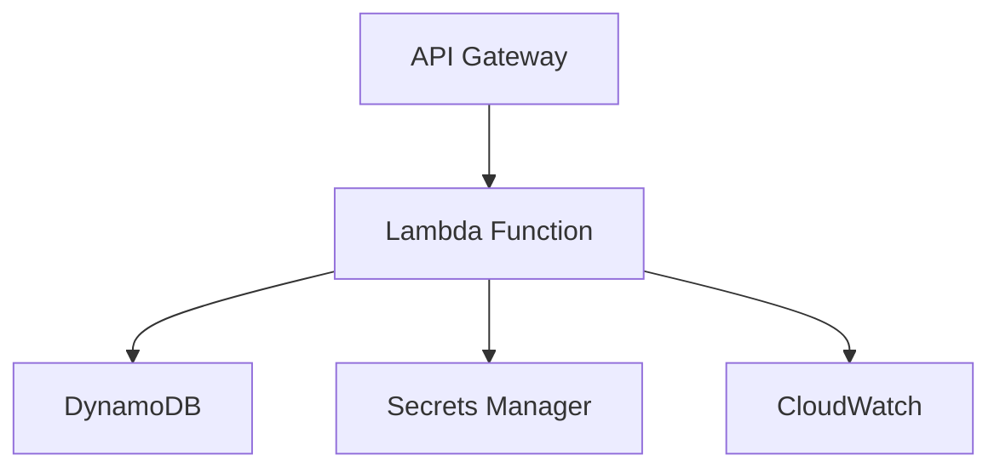

<!--
title: 'Tezda Auth Service'
description: 'A secure authentication service built with Node.js, TypeScript, AWS Lambda, API Gateway, and DynamoDB.'
layout: Doc
framework: v4
platform: AWS
language: nodeJS
priority: 1
authorLink: 'https://github.com/brianxcode'
authorName: 'Brian Fatokun'
-->

# Authentication Service

A secure, scalable authentication service built with AWS Lambda, API Gateway, and DynamoDB.

## Features

- User registration with email and password
- User login with JWT authentication
- Secure password hashing with bcrypt
- Input validation
- Rate limiting
- Comprehensive error handling

## Security Measures

### Authentication
- JWT-based stateless authentication
- Configurable token expiration
- Secure token generation and validation
- Environment-based configuration

### Data Protection
- Password hashing with bcrypt
- Input sanitization
- Secure error handling
- No sensitive data exposure in responses

### Infrastructure
- IAM roles with least privilege
- Secure environment variables
- VPC configuration (if applicable)
- AWS KMS for secret management

## Performance Considerations

### Current Implementation
- Cold start optimization
- Connection pooling for DynamoDB
- Efficient error handling
- Optimized payload sizes

### Recommended Improvements
- [ ] Implement caching layer (Redis/DAX)
- [ ] Add request/response compression
- [ ] Optimize cold starts with provisioned concurrency
- [ ] Implement connection pooling for database connections

## Getting Started

### Prerequisites
- Node.js 16.x or higher
- AWS Account with appropriate permissions
- AWS CLI configured
- Serverless Framework installed globally

### Installation

1. Clone the repository:
   ```bash
   git clone https://github.com/brianXcode/tezda-auth-service.git
   cd auth-service
   ```

2. Install dependencies:
   ```bash
   npm install
   ```

3. Configure environment variables:
   ```bash
   cp .env.example .env
   # Edit .env with your configuration
   ```

### Deployment

```bash
# Deploy to AWS
serverless deploy

# Deploy to specific stage
serverless deploy --stage production
```

## API Endpoints

### POST /register
Register a new user.

**Request Body:**
```json
{
  "email": "user@example.com",
  "password": "securePassword123!"
}
```

**Response:**
```json
{
  "userId": "123e4567-e89b-12d3-a456-426614174000",
  "email": "user@example.com",
  "token": "eyJhbGciOiJIUzI1NiIsInR5cCI6IkpXVCJ9..."
}
```

### POST /login
Authenticate a user.

**Request Body:**
```json
{
  "email": "user@example.com",
  "password": "securePassword123!"
}
```

**Response:**
```json
{
  "userId": "123e4567-e89b-12d3-a456-426614174000",
  "email": "user@example.com",
  "token": "eyJhbGciOiJIUzI1NiIsInR5cCI6IkpXVCJ9..."
}
```

## Security Best Practices

1. **Secrets Management**
   - Store secrets in AWS Secrets Manager or Parameter Store
   - Use environment variables for configuration
   - Rotate secrets regularly

2. **Input Validation**
   - Validate all incoming requests
   - Sanitize user inputs
   - Implement rate limiting

3. **Monitoring**
   - Enable CloudWatch logging
   - Set up alarms for failed authentication attempts
   - Monitor API Gateway metrics

## Development

### Running Tests
```bash
npm test
```

### Linting
```bash
npm run lint
```

### Local Development
```bash
# Start local development server
npm run dev
```

## Architecture



## Contributing

1. Fork the repository
2. Create your feature branch (`git checkout -b feature/AmazingFeature`)
3. Commit your changes (`git commit -m 'Add some AmazingFeature'`)
4. Push to the branch (`git push origin feature/AmazingFeature`)
5. Open a Pull Request

## License

Distributed under the MIT License. See `LICENSE` for more information.

## Contact

Brian Fatokun - [@brianxcode](https://twitter.com/brianxcode) - brianxcode@example.com

Project Link: [https://github.com/brianxcode/auth-service](https://github.com/brianxcode/auth-service)

## Acknowledgements

- [AWS Lambda](https://aws.amazon.com/lambda/)
- [Serverless Framework](https://www.serverless.com/)
- [JSON Web Tokens](https://jwt.io/)
- [bcrypt](https://www.npmjs.com/package/bcrypt)
